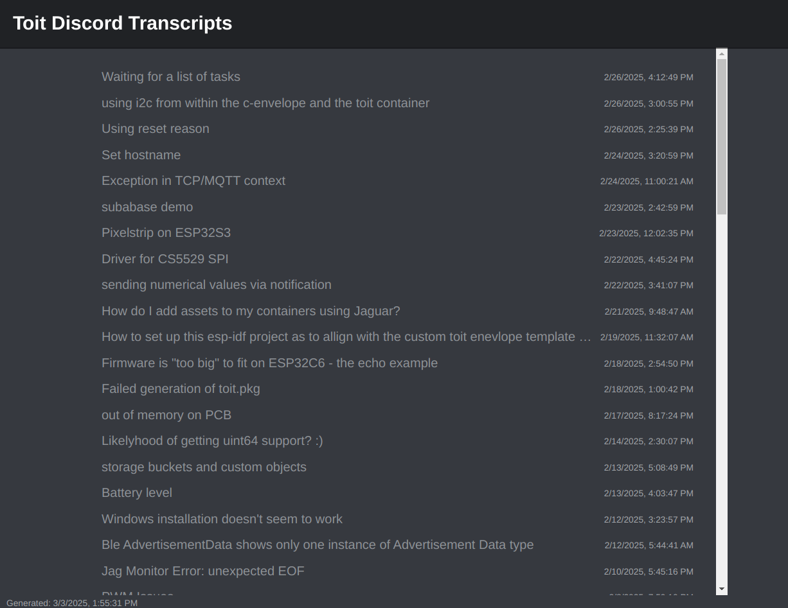

# Discord Transcript Action

This bot connects to Discord and generates HTML transcripts for the #help
channel.

## Features

- Generates HTML transcripts using the `discord-html-transcripts` package
- Saves transcripts to a specified output directory

### Inputs

- `discord-token`: The authentication token of the Discord bot. See below for
  instructions on how to create a bot and get the token.
- `guild-id`: The guild ID. You can find this by right-clicking on the server
  icon and selecting "Copy ID".
- `transcript-directory`: The directory where the transcripts are/will be saved.

If an existing directory is specified, then the action will only fetch threads
that have been modified or don't exist yet.

## Example

```yaml
env:
  # Don't forget to put the guild ID in quotes.
  GUILD_ID: '123456789012345678'
---
- name: 'Run the transcript action'
  uses: toitlang/action-discord-transcript@v1.3.0
  with:
    discord-token: ${{ secrets.DISCORD_TOKEN }}
    guild-id: { { env.GUILD_ID } }
    transcript-directory: transcripts
```

Typically, this step is followed by a step that commits the output, and one that
uploads the transcript to the gh-pages branch of the repository.

```yaml
- name: 'Commit the transcripts'
  run: |
    git config --global user.email "github-actions[bot]@users.noreply.github.com"
    git config --global user.name "github-actions[bot]"
    git add transcripts
    git commit -m "Update transcripts"
    git push

- name: 'Upload to gh-pages'
  uses: peaceiris/actions-gh-pages@v4
  with:
    github_token: ${{ secrets.GITHUB_TOKEN }}
    publish_dir: transcripts
    cname: 'example.com'
```

## Output

The transcript directory contains an HMTL file for each thread in the #help
forum.

In addition, the output directory contains a `index.html` file that links to all
the transcripts.

Finally, it also produces an `index.json` file that contains the metadata for
each transcript. This can be used to generate a more complex index page.

Here is a screenshot of the generated index page for the
[Toit Discord page](https://chat.toit.io), served at the
[Toit help](https://help.toit.io) page.



## Incremental updates

If the transcript directory already exists and contains the index.json file,
then the action will only fetch threads that have been modified or don't exist
yet.

## Run locally

You can also just run the transcript generation locally.

Make sure to run with Node 20. Use, for example, `nvm` to install it. The
repository contains a `.nvmrc` file that specifies the node version that works.
It also contains a `.node-version` file that is used by GitHub to fetch the
correct version.

If you have nvm installed, but not automatically activated in your .bashrc, you
will need to do

```bash
source /usr/share/nvm/init-nvm.sh
```

Then run `nvm install` to install the correct version of node.

Install the dependencies.

```bash
npm install
```

Save the Discord credentials and your input parameters to a `.env` file. Use the
.env.example as a starting point.

```bash
INPUT_discord-token=YOUR_DISCORD_TOKEN
INPUT_guild-id=YOUR_GUILD_ID
INPUT_transcript-directory=transcripts
```

Run the script.

```bash
npm run local-action
```

## Discord bot

The following instructions mirror the ones provided on Discord's official
[quick-start guide](https://discord.com/developers/docs/quick-start/getting-started)

To create a Discord bot, follow these steps:

- Create a
  [new application](https://discord.com/developers/applications?new_application=true)
- In the 'Installation' tab:
  - Unselect 'User Install'.
  - Switch the Install link to 'None'.
  - Save the changes.
- In the 'Bot' tab:
  - click on 'Reset Token'. This will generate a new token. You will need this
    token as input to the action. Typically it is saved as a GitHub Action
    secret.
  - Disable 'Public bot'.
  - Enable 'Message content intent'.
  - Save the changes
- In the 'OAuth2' tab:
  - In the scopes select 'bot'. This opens up the bot permissions.
  - In the bot permissions, select 'View Channels' and 'Read Message History'.
  - Copy the URL and paste it in your browser. This will open a page that allows
    you to add the bot to a server. Select the server where you want to run the
    action.

You can uninstall a bot by kicking it from the server.

## References

This repository is based on the
[TypeScript Action template](https://github.com/actions/typescript-action).
